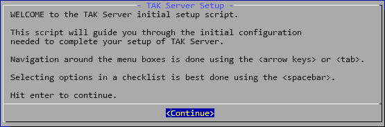
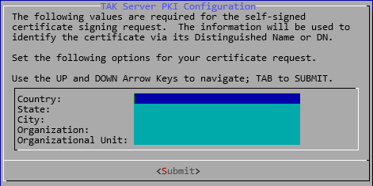
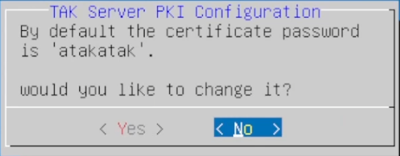
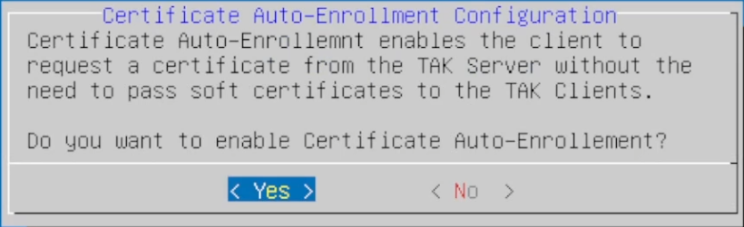
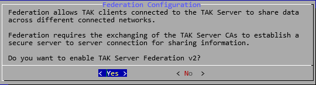
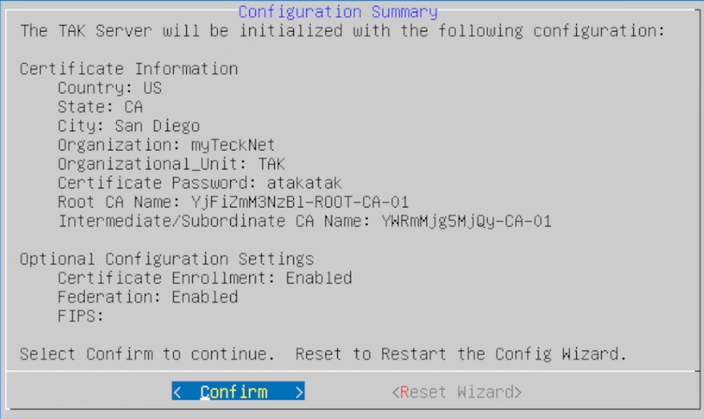
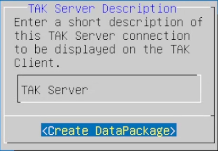
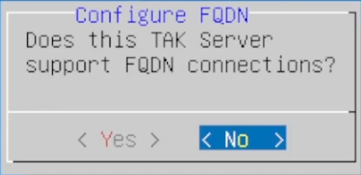

[tpc]: https://tak.gov
[takServer]: https://tak.gov/products/tak-server
# Description
Using the [TAK Server installation binaries or Docker images][takserver] provided by [TAK.gov][tpc], the `installTAK` script provides a one-command installation solution for all TAK enthusiasts to get a TAK Server up and running in minutes on a freshly installed operating system.

## Operating Systems Tested:
All operating systems were tested with a minimal installation unless specifically annotated differently.
- Rocky Linux 8
- Ubuntu Server 22
- Docker version 24
- PhotonOS w/ Docker Installed
- Rasbian Desktop (64-bit) on Raspberry Pi 5 w/ 8GB RAM

# Installation
To install the `installTAK` script from the source use the following commands to install the repository to a folder of your choice:
```shell
git clone https://github.com/myTeckNetCode/installTAK.git ./installTAK --recurse-submodules
cd installTAK
```
The above command will install the installTAK script in the current directory in a new folder called *installTAK*.

If you have not done so already, head to [TAK.gov][tpc], download the [TAK Server][takserver] installation files, and place them in this newly created *installTAK* directory.

Run the following command to begin the installation:
```shell
chmod +x installTAK
./installTAK
```
Running `installTAK` alone will display the intended command usage.  For example is the **takserver-5.2-RELEASE43.noarch.rpm** and **takserver-public-gpg.key** are in the installTAK directory run the following:
```shell
./installTAK takserver-5.2-RELEASE43.noarch.rpm
```
For Ubuntu/Debian systems ensure to download the **deb_policy.pol** and place it in the *installTAK* directory.

## Installation from Download ZIP
Installation from ZIP requires external repository contents.  Download the **installTAK.zip** and then download the **tak-server-systemd.zip** from [here](https://github.com/talentedbrute/tak-server-systemd).

1. Extract the installTAK.zip
2. Extract tak-server-systemd.zip into the installTAK directory created

Final directory tree should look like this:
```
installTAK
├───lib
│   └───img
└───tak-server-systemd
    └───etc
        └───systemd
            └───system
```
## Installation Command Examples:
script usage: installTAK [path to TAK Server installer [rpm | deb | zip ]]
```shell
# RPM
./installTAK takserver-*.noarch.rpm
```
```shell
# Ubuntu/Raspberry-Pi
./installTAK takserver-*_ALL.deb
```
```shell
# Docker/Container
./installTAK takserver-docker-*.zip
```

The `installTAK` script will detect the operating system it is being run against to determine the prerequisites needed to install the TAK Server.  After the prerequisites have been installed, it will install the takserver binary or container.  Following a complete installation or deployment of the TAK Server or container the TAK Server wizard will run to complete the remaining steps.



In the following prompt, enter the certificate information associated with your organization.  All fields are required, City names with spaces are okay here.



If you wish to change the default certificate password, you have the option to do it here.



Enter the name for your Root Certificate Authority (CA); otherwise, if you leave this blank a random name will be generated for you.

")

Enter the name of your Intermediate Certificate Authority (CA), this certificate is used to sign and issue certificates on behalf of the root CA; otherwise, if you leave this blank a random name will be generated for you.

")

Certificate enrollment allows you as the TAK Administrator to pass a preconfigured data package (**enrollmentDP.zip**) to users/clients that will prompt the user for credentials needed to authenticate to the TAK Server.  Credentials are managed in the **Manage Users** UI of the TAK Server.  Selecting **yes** here will open TCP Port `8446` inbound for enrollment.



Enabling TAK Server Federation allows you to share data that is owned by the TAK Server to other TAK Servers.  Selecting **yes** here will open TCP Port `9001` for inbound TAK Federation.



The following prompt provides the configuration summary.  Review this prompt for accuracy, select **Confirm** to commit all changes or select **Reset Wizard** to run through the TAK Wizard again.



### [Optional] Certificate Enrollment
If you selected **yes** to enable certificate auto-enrollment, you will be presented with an input to name this TAK Server description connection.  This will be displayed on the TAK Clients as the friendly name.



If your TAK Server is public facing and has a registered Domain Name and associated record you can select yes to enter the FQDN information here.  Otherwise, selecting **no** will use the ip address for connections.



### Post Installation Files
- Certificate Auto-Enrollment
    - Yes: enrollmentDP.zip
    - No: caCert.p12
- webadmin.p12

# Post Installation Tasks
Following the execution of the `installTAK` the **webadmin.p12** is created by default.  This is the TAK Server administrator certificate used to administer the TAK Server from the browser.  This file needs to be copied from the TAK Server to your local workstation.  Most modern operating systems come with secure shell (ssh) installed by default.  If you don't feel comfortable with the command line interface (CLI) tools like [WinSCP](https://winscp.net/eng/index.php) are available.
To copy files from Linux using SCP run the following command:
**Syntax**: scp <username>@<ipaddress>:~/webadmin.p12 <destinationDir>
```shell
scp takadmin@192.168.1.100:~/webadmin.p12 .
```
**Note**: There is a period (.) and a space following the .p12 file extension.  This denotes the current working directory the terminal/shell is in.
```shell
# [Windows] This will copy the webadmin.p12 to the current user's downloads directory
scp takadmin@192.168.1.100:~/webadmin.p12 %userprofile%\Downloads
```