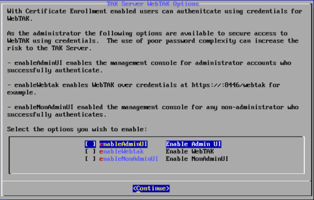
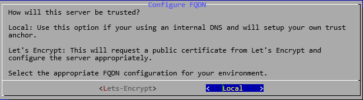
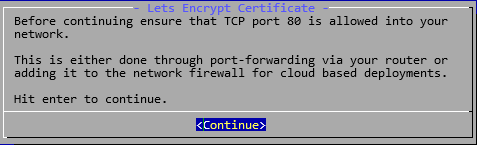
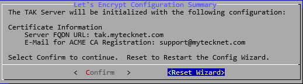
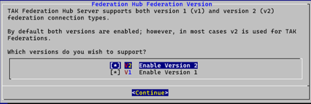
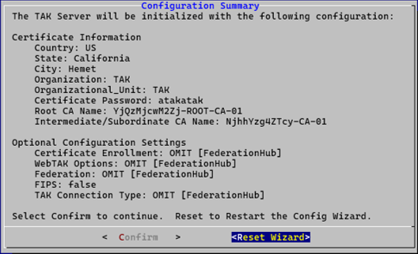

[tpc]: https://tak.gov
[takServer]: https://tak.gov/products/tak-server
[mytecknet-ca]: https://mytecknet.com/lets-sign-our-tak-server/
[walkthrough]: https://youtu.be/-mjqOsbfu9c
# Description
Using the [TAK Server installation binaries or Docker images][takserver] provided by [TAK.gov][tpc], the `installTAK` script provides a one-command installation solution for all TAK enthusiasts to get a TAK Server up and running in minutes on a freshly installed operating system.

A video walk-through can be found [here][walkthrough].

**Federation Hub** instructions can be found [here](#federation-hub)

## Operating Systems Tested:
All operating systems were tested with a minimal installation unless specifically annotated differently.
- Rocky Linux 8
- Rocky Linux 9
- Red Hat Enterprise Linux (RHEL) 8 [**Not Hardened**]
- Red Hat Enterprise Linux (RHEL) 9 [**Not Hardened**]
- **Ubuntu Server 22 LTS**
- **Ubuntu Server 24 LTS**
- Docker version 24
- PhotonOS w/ Docker Installed
- Raspbian Desktop (64-bit) on **Raspberry Pi 5 w/ 8GB RAM**
- Ubuntu 22/24 LTS on **Raspberry Pi 5 w/ 8GB RAM**

**NOTE:** *Ubuntu Long Term Support (TLS)* versions tested only, all other versions may not work.

# Installation
To install the `installTAK` script from the source use the following commands to install the repository to a folder of your choice:
```shell
git clone https://github.com/myTeckNet/installTAK.git ./installTAK && cd ./installTAK
```
The above command will install the installTAK script in the current directory in a new folder called *installTAK*.  After the repository has been cloned navigate to the *installTAK* directory.
```
cd installTAK
```

If you have not done so already, head to [TAK.gov][tpc], download the [TAK Server][takserver] installation files, and place them in this newly created *installTAK* directory.

Run the following command to display the installation arguments:
```shell
./installTAK
```
Running `installTAK` alone will display the intended command usage.  For example is the **takserver-5.3-RELEASE4.noarch.rpm** and **takserver-public-gpg.key** are in the installTAK directory run the following:
```shell
./installTAK takserver-5.3-RELEASE4.noarch.rpm
```
For Ubuntu/Debian systems ensure to download the **deb_policy.pol** and place it in the *installTAK* directory.

To enable **FIPS** Certificates append *--fips* at the end of the command.  Custom certificates with stronger algorithms will be generated for use on systems with **FIPS** enabled.  **ATAK** may not support certificates generated with these stronger algorithms.  Use at your own discretion.
```shell
./installTAK takserver-5.3-RELEASE4.noarch.rpm --fips
```

## Installation from Download ZIP
Installation from ZIP requires external repository contents.  Download the **installTAK.zip**.

1. Extract the installTAK.zip

Final directory tree should look like this:
```
installTAK
├───lib
│   └───img
```
## Installation Command Examples:
script usage: installTAK [path to TAK Server installer [rpm | deb | zip ]]
```shell
# RPM
./installTAK takserver-*.noarch.rpm
```
```shell
# Ubuntu/Raspberry-Pi
./installTAK takserver-*_ALL.deb
```
```shell
# Docker/Container
./installTAK takserver-docker-*.zip
```

The `installTAK` script will detect the operating system it is being run against to determine the prerequisites needed to install the TAK Server.  After the prerequisites have been installed, it will install the takserver binary or container.  Following a complete installation or deployment of the TAK Server or container the TAK Server wizard will run to complete the remaining steps.


In the following prompt, enter the certificate information associated with your organization.  All fields are required, City names with spaces are okay here.


If you wish to change the default certificate password, you have the option to do it here.


### [Optional] Certificate Password
If you select **yes** to change the default certificate password, enter your new password here.


Enter the name for your Root Certificate Authority (CA); otherwise, if you leave this blank a random name will be generated for you.

")

Enter the name of your Intermediate Certificate Authority (CA), this certificate is used to sign and issue certificates on behalf of the root CA; otherwise, if you leave this blank a random name will be generated for you.

")

Certificate enrollment allows you as the TAK Administrator to pass a preconfigured data package (**enrollmentDP.zip**) to users/clients that will prompt the user for credentials needed to authenticate to the TAK Server.  Credentials are managed in the **Manage Users** UI of the TAK Server.  Selecting **yes** here will open TCP Port `8446` inbound for enrollment.


Enabling TAK Server Federation allows you to share data that is owned by the TAK Server to other TAK Servers.  Selecting **yes** here will open TCP Port `9001` for inbound TAK Federation.


By default the TAK Server accepts connections over **SSL/TLS**.  Additionally, the TAK Server supports the **QUIC** protocol.  Select the appropriate connection type for this TAK Server.


When certificate enrollment is enabled it opens credentialed access via the API on TCP port `8446`.  The practice of poor passwords and complexity could open this as a potential attack vector for administrative access.  Select the options that are required for your deployment.  Otherwise, selecting none will only allow certificate requests and not access to WebTAK features.



The following prompt provides the configuration summary.  Review this prompt for accuracy, select **Confirm** to commit all changes or select **Reset Wizard** to run through the TAK Wizard again.


### [Optional] Certificate Enrollment
If you selected **yes** to enable certificate auto-enrollment, you will be presented with an input to name this TAK Server description connection.  This will be displayed on the TAK Clients as the friendly name.


If your TAK Server is public facing and has a registered Domain Name and associated record you can select yes to enter the FQDN information here.  Otherwise, selecting **no** will use the ip address for connections.


### [Optional] Fully Qualified Domain Name (FQDN) Connections
If you selected **yes** that this TAK Server supports FQDN Connections, you will be asked how this TAK Server will be trusted.  If you or your organization have a registered Domain Name, select **Local**.  



Selecting Local will not create a certificate signing request as the local csr can be used or a local one be generated manually.  Click [here][mytecknet-ca] learn more about using a third-party certificate signer.  By default, the TAK Server IP Address is displayed.


Selecting **Let's Encrypt** will utilize Let's Encrypt as the public Certificate Authority and will begin the public certificate signing request and issuance.

Before continuing with the **Let's Encrypt** configuration ensure that you allow TCP port 80 into your network by either enabling port forwarding in your router to the TAK Server or cloud service provider (CSP).  Consult your CSP for specific instructions.



Enter the public host record for this TAK Server.  This is commonly associated to the Host Record created in the Domain Name System (DNS) Server or your DNS cloud provider.  Additionally, enter an email to associate this host record; by <u>**default**</u> this email **will not** be shared with *Let's Encrypt* or *Certbot* however is a requirement in the certificate request.


The following prompt provides the configuration summary.  Review this prompt for accuracy, select **Confirm** to commit all changes or select **Reset Wizard** to run through the Let's Encrypt Wizard again.



### Post Installation Files
After successful installation the local *installTAK* repo will delete itself since its only meant to run once.  The TAK Server installation binary and dependencies will be included.  Based on your responses to the TAK Setup Wizard the following files will be created in the current users Linux home directory (/home/$USER) or if root (/root).

- Certificate Auto-Enrollment
    - Yes: enrollmentDP.zip
    - No: caCert.p12
- webadmin.p12

# Federation-Hub
The TAK Server Federation Hub enables forwarding of federated TAK data in a multi-hop setup. The hub supports centralized management of federation 
configuration using a hub and spoke topology. Instead of TAK server federates connecting to each other directly, they connect to a Federation Hub. The 
hub performs connection and trust management, and brokers federated data according to a policy defined by an administrator.  The TAK Server Federation Hub software can be installed and run independently of TAK Server.

## Installation
The `installTAK` script will detect the operating system it is being run against to determine the prerequisites needed to install the TAK Server Federation Hub.  After the prerequisites have been installed, it will install the federation-hub binary or container.  Following a complete installation or deployment of the TAK Server Federation Hub or container the TAK Server Federation Hub wizard will run to complete the remaining steps.

At the following prompt, select the Federation version you wish to support to establish federated connections.  Use the space bar to toggle between on or off.  Selecting Version 2 will open TCP port `9102` and selecting Version 1 will open TCP port `9101` respectively.  Enable the appropriate version to match your federated ecosystem.



Additionally, the TAK Server Federation Hub supports JSON Web Token (JWT) to establish an authenticated federation rather than the mutual client authentication with certificates.  Selecting *Yes* will enable Federation Token Authentication and open TCP port `9103`.  Otherwise, selecting *No* will disable this feature.


The following prompt provides the configuration summary.  Review this prompt for accuracy, select **Confirm** to commit all changes or select **Reset Wizard** to run through the TAK Wizard again.



# Post Installation Tasks
Following the execution of the `installTAK` the **webadmin.p12** is created by default.  This is the TAK Server administrator certificate used to administer the TAK Server from the browser.  This file needs to be copied from the TAK Server to your local workstation.  Most modern operating systems come with secure shell (ssh) installed by default.  If you don't feel comfortable with the command line interface (CLI) tools like [WinSCP](https://winscp.net/eng/index.php) are available.
To copy files from Linux using SCP run the following command:
**Syntax**: scp <username>@<ipaddress>:~/webadmin.p12 <destinationDir>
```shell
scp takadmin@192.168.1.100:~/webadmin.p12 .
```
**Note**: There is a period (.) and a space following the .p12 file extension.  This denotes the current working directory the terminal/shell is in.
```shell
# [Windows] This will copy the webadmin.p12 to the current user's downloads directory
scp takadmin@192.168.1.100:~/webadmin.p12 %userprofile%\Downloads
```